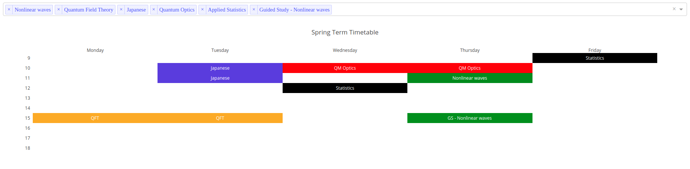

# Timetable

This is a practice exercise with plotly to create a timetable using a heatmap. timetable.py is the timetable itself, while dash_timetable.py is essentially the same timetable on an interactive dashboard, where the selected lectures will be displayed according to the dropdown, see 
